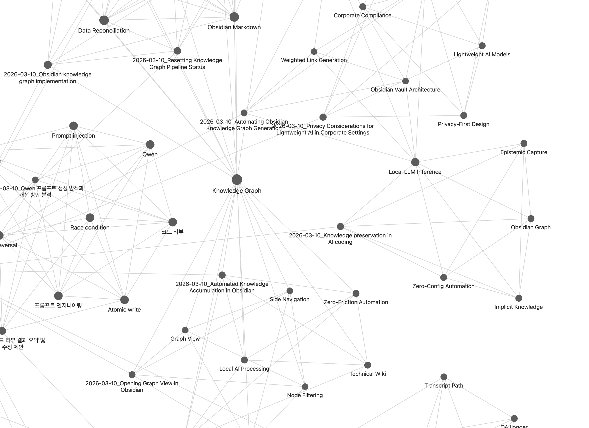

# claude-knowledge-graph

Auto-capture Claude Code Q&A → Qwen 3.5 tagging/summarization → Obsidian knowledge graph

Automatically captures all conversations from Claude Code, tags and summarizes them with a local LLM (Qwen 3.5 4B), and builds a knowledge graph in your Obsidian vault.



## Why?

- **Knowledge disappears after every session** — Debugging insights, architecture decisions, and problem-solving patterns from Claude Code vanish when the session ends. This tool automatically turns them into searchable, structured notes.
- **Zero friction** — Hook-based auto-capture means you don't have to do anything. Just use Claude Code as usual.
- **Fast & lightweight edge AI** — Qwen 3.5 4B runs in the background and finishes tagging in seconds, never interrupting your workflow.
- **Privacy-safe** — All processing stays on your machine. Safe for enterprise environments where code-related conversations must not leave the local network.
- **Unified work archive** — No matter which project or directory you're working in, everything converges into a single Obsidian vault. Search and reflect on your entire work history in one place.
- **Connected knowledge graph** — Concepts are linked via wikilinks and shared tags, so you can visually explore how your technical topics relate to each other over time.

## Key Features

- **Auto-capture**: Collects all Q&A pairs automatically via Claude Code Hooks
- **Local LLM tagging**: llama.cpp + Qwen 3.5 4B GGUF (~2.5GB VRAM)
- **Auto-trigger**: Background tagging → note generation on Stop hook
- **Obsidian knowledge graph**: Auto-generates Daily notes, Concept notes, and MOC
- **Auto-linking between concepts**: Wikilinks based on co-occurrence + shared tags
- **Memory classification**: Static/dynamic memory types with importance scoring (1-5)
- **Rich relationships**: Updates/Extends/Derives relationship detection between concepts
- **Developer profile**: Auto-generated `_Profile.md` with skills, recent activity, top concepts
- **Semantic search**: Embedding-based query via dedicated GGUF model (Qwen3-Embedding)
- **Vault search skill**: `/vault-search` slash command for in-session knowledge retrieval

## How It Works

```
Claude Code session
  │
  ├─ UserPromptSubmit hook → capture prompt
  └─ Stop hook → generate Q&A pair → background processing
                    │
                    ▼
            Qwen 3.5 4B (via llama-server)
            → title, summary, tags, concepts, memory_type, importance
                    │
                    ▼
            Qwen3-Embedding (via llama-server, separate port)
            → vector embeddings for semantic search
                    │
                    ▼
            Obsidian vault/knowledge-graph/
            ├── _MOC.md              (Map of Content)
            ├── _Profile.md          (auto-generated developer profile)
            ├── daily/YYYY-MM-DD.md  (daily conversation log)
            ├── sessions/*.md        (individual session notes)
            ├── concepts/*.md        (concept notes with version history)
```

## Installation

> **macOS (Apple Silicon) detailed guide**: [docs/install-macos-apple-silicon.md](docs/install-macos-apple-silicon.md)
>
> **Windows (x86/NVIDIA GPU) detailed guide**: [docs/x86_windows_guide_en.md](docs/x86_windows_guide_en.md) ([한국어](docs/x86_windows_guide.md)) — covers `fcntl` replacement, encoding fixes, llama-server CUDA setup, and all Windows-specific patches

### 1. Install the package

```bash
git clone https://github.com/NAMYUNWOO/claude-knowledge-graph.git
cd claude-knowledge-graph
pip install -e .
```

### 2. Install llama-server

```bash
# macOS (Homebrew)
brew install llama.cpp

# macOS (build from source — auto-detects Metal)
git clone https://github.com/ggml-org/llama.cpp
cd llama.cpp
cmake -B build -DBUILD_SHARED_LIBS=OFF
cmake --build build --config Release -j$(sysctl -n hw.ncpu) --target llama-server

# Linux (CUDA)
git clone https://github.com/ggml-org/llama.cpp
cmake llama.cpp -B llama.cpp/build \
    -DBUILD_SHARED_LIBS=OFF \
    -DGGML_CUDA=ON \
    -DCMAKE_CUDA_ARCHITECTURES="89"
cmake --build llama.cpp/build --config Release -j$(nproc) --target llama-server
```

> `CMAKE_CUDA_ARCHITECTURES`: RTX 40xx=89, RTX 30xx=86, RTX 20xx=75
>
> If `llama-server` is not on your PATH after building from source, specify the path directly in config.json (see Configuration below).

### 3. Download the GGUF models

**Tagging model** (required, ~2.6 GB):

```bash
pip install huggingface-hub
huggingface-cli download unsloth/Qwen3.5-4B-GGUF \
  --include "*Q4_K_M*" \
  --local-dir ~/.local/share/claude-knowledge-graph/models/Qwen3.5-4B-GGUF
```

**Embedding model** (optional, ~610 MB — enables semantic search):

```bash
huggingface-cli download Qwen/Qwen3-Embedding-0.6B-GGUF \
  --include "*Q8_0*" \
  --local-dir ~/.local/share/claude-knowledge-graph/models/Qwen3-Embedding-0.6B-GGUF
```

> If `huggingface-cli` is not found, use Python directly:
> ```bash
> python -c "from huggingface_hub import snapshot_download; snapshot_download('Qwen/Qwen3-Embedding-0.6B-GGUF', allow_patterns=['*Q8_0*'], local_dir='$HOME/.local/share/claude-knowledge-graph/models/Qwen3-Embedding-0.6B-GGUF')"
> ```

| Model | Purpose | Size | VRAM |
|-------|---------|------|------|
| Qwen3.5-4B Q4_K_M | Tagging/summarization | ~2.6GB | ~3GB |
| Qwen3-Embedding-0.6B Q8_0 | Semantic search | ~610MB | ~1GB |
| Qwen3.5-9B Q4_K_XL | Tagging (higher quality) | ~5.6GB | ~6.5GB |

### 4. Initialize

```bash
ckg init --vault-dir ~/my-obsidian-vault
```

If llama-server or the GGUF model can't be auto-detected, you'll be prompted to enter the paths manually:

```
$ ckg init --vault-dir ~/my-obsidian-vault
...
llama-server: NOT FOUND (auto-detect failed)
  Enter llama-server path (or press Enter to skip): /path/to/llama-server
Model: NOT FOUND (auto-detect failed)
  Enter GGUF model path (or press Enter to skip): /path/to/Qwen3.5-4B-Q4_K_M.gguf
```

**Auto-detect works when:**
- **llama-server**: available in your `PATH` (e.g. via `brew install llama.cpp`)
- **Model**: a `.gguf` file exists under `~/.local/share/claude-knowledge-graph/models/`

You can also set paths explicitly in `~/.config/claude-knowledge-graph/config.json`:

```json
{
  "llama_server": "/path/to/llama-server",
  "model_path": "/path/to/Qwen3.5-4B-Q4_K_M.gguf"
}
```

> **Tip**: To change paths later, edit `config.json` directly — no need to re-run `ckg init`.

> **WSL users**: Set `vault-dir` under `/mnt/c/` so that Windows Obsidian can access it. Obsidian on Windows cannot open vaults inside the WSL filesystem (e.g. `~/my-vault`), which will cause errors.
> ```bash
> ckg init --vault-dir /mnt/c/Users/<YourWindowsUsername>/obsidian-vault
> ```

This command will:
- Create `~/.config/claude-knowledge-graph/config.json`
- Create `~/.local/share/claude-knowledge-graph/{queue,processed,logs}` directories
- Auto-register hooks in `~/.claude/settings.json`
- Verify llama-server and model paths

## Usage

After installation, **it works automatically whenever you use Claude Code**.

```bash
# Check status
ckg status

# Run pipeline manually (tagging + embedding + note generation)
ckg run

# Semantic search across your knowledge
ckg query "Python virtual environments"

# Search with filters
ckg query "debugging" --type static --top-k 10

# Get AI-ready context (profile + search results)
ckg query --context "current project architecture"

# Regenerate embeddings for all Q&A pairs
ckg embed

# Unregister hooks
ckg uninstall
```

### Vault Search Skill (in Claude Code)

Use `/vault-search` inside any Claude Code session to search your knowledge graph:

```
/vault-search Obsidian knowledge graph
/vault-search 게임 치트 탐지
```

## CLI Commands

| Command | Description |
|---------|-------------|
| `ckg init --vault-dir <path>` | Create config + register hooks |
| `ckg run` | Run pipeline (tagging → embedding → Obsidian notes) |
| `ckg status` | Show pending/processed/written counts + hooks status |
| `ckg query "<text>"` | Semantic search (--top-k, --type, --category, --context) |
| `ckg embed` | Regenerate embeddings for all processed Q&A pairs |
| `ckg uninstall` | Unregister hooks + optionally delete config |

## Configuration

Config file: `~/.config/claude-knowledge-graph/config.json`

Data directory: `~/.local/share/claude-knowledge-graph/`

### config.json example

```json
{
  "vault_dir": "/path/to/your/Obsidian Vault",
  "llama_server": "/path/to/llama-server",
  "model_path": "/path/to/Qwen3.5-4B-Q4_K_M.gguf",
  "llama_port": 8199
}
```

`vault_dir` is set automatically by `ckg init`. The rest only need to be specified if auto-detection fails.

### Environment Variables

Environment variables take priority over config.json.

| Variable | Description | Default |
|----------|-------------|---------|
| `CKG_VAULT_DIR` | Obsidian vault path | Read from config file |
| `CKG_LLAMA_SERVER` | llama-server binary path | Search PATH |
| `CKG_MODEL_PATH` | GGUF model file path | Search data dir |
| `CKG_LLAMA_PORT` | llama-server port | `8199` |
| `CKG_EMBED_MODEL_PATH` | Embedding GGUF model path | Scan `models/*embed*` |
| `CKG_EMBED_PORT` | Embedding server port | `8198` |

## Output Structure

```
your-vault/knowledge-graph/
├── _MOC.md                    # Map of Content (full index)
├── _Profile.md                # Auto-generated developer profile
├── daily/
│   ├── 2026-03-10.md          # Daily conversation log
│   └── 2026-03-11.md
├── sessions/
│   ├── 2026-03-10_React Setup.md  # Individual session (memory_type, importance)
│   └── 2026-03-11_Docker Fix.md
├── concepts/
│   ├── Python Virtual Environments.md  # Version history + typed relationships
│   ├── Docker.md
│   └── REST API.md
```

### Memory Types

Each Q&A pair is classified as:
- **Static**: Permanent facts, reusable patterns, architecture decisions (e.g., "how to set up venv")
- **Dynamic**: Session-specific, time-sensitive info (e.g., "debugging this specific error")

### Relationship Types

Concepts are connected with typed relationships:
- **Updates**: New info supersedes old (e.g., "migrated from React 17 → 18")
- **Extends**: Additional context enriching existing knowledge
- **Derives**: Inferred connections from co-occurrence patterns
- **Co-occurrence**: Concepts appearing together in the same session

### Developer Profile

`_Profile.md` is auto-generated with:
- **Core Skills** (from static, high-importance memories)
- **Recent Activity** (dynamic memories from last 7 days)
- **Top Concepts** (by frequency across all sessions)

## Optional: Graph Visualization

```bash
pip install claude-knowledge-graph[graph]
python scripts/gen_graph_image.py
```

## Requirements

- Python 3.10+
- [Claude Code](https://claude.com/claude-code) CLI
- llama.cpp (`llama-server`)
- GPU recommended (CPU works but is slower)

## Performance

| Item | Value |
|------|-------|
| llama-server startup | ~2-7s |
| Tagging per file | 2-4s |
| Embedding per file | <1s |
| Semantic search query | ~2s (incl. server startup) |
| VRAM (tagging) | ~2.5GB (Q4_K_M) |
| VRAM (embedding) | ~1GB (Q8_0) |
| Note generation | <1s |

> Tagging and embedding servers run sequentially, never concurrently, to share VRAM.

## License

MIT
